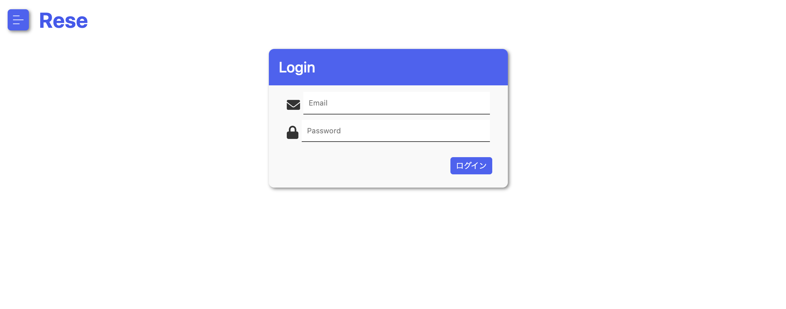
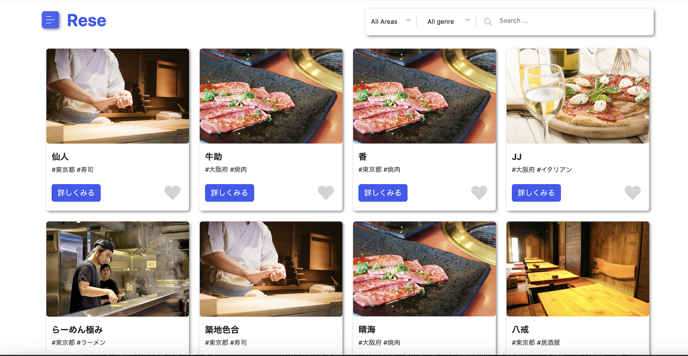
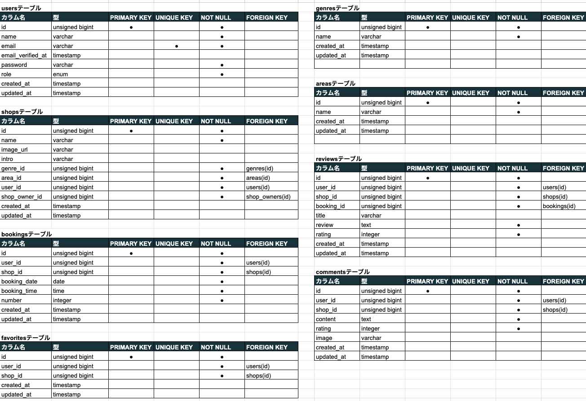
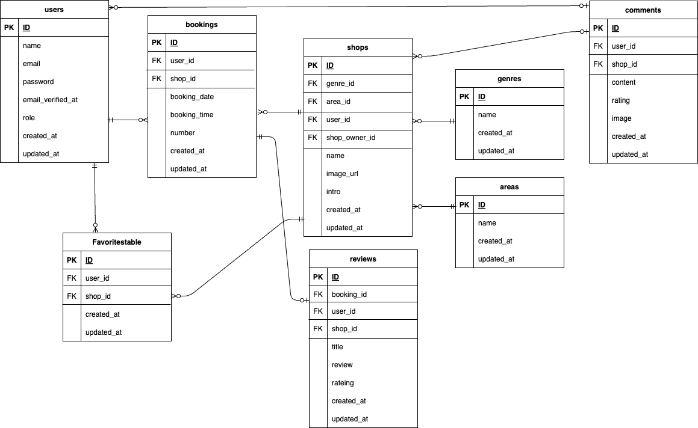

# 飲食店予約アプリ　Diningnavi

会員登録なしでも閲覧は可能ですが、飲食店を予約をする場合は会員登録が必要。 
氏名、メールアドレス、パスワードを入力、登録し、そのメールアドレスに届く確認メールを開き、 
メールアドレスとパスワードを入力しログインします。  
 

## 作成した目的
ごちゃごちゃと煩雑でなく見やすいページ構成で、必要な機能のみで操作も簡単、 
そしてもっと手軽に飲食店を予約できるアプリがあればいいな、と思い開発しました。 

## アプリケーションURL
http://15.168.189.188

## 機能一覧
- **管理画面** : ユーザー、管理者、店舗代表者の3つの権限でそれぞれ異なる機能にアクセス可能。  
   - **ユーザー** : [会員登録](http://localhost/user/register)  
   - ※メール認証を通じて安全なログイン・ログアウト機能を提供。  
   - **管理者** : [管理者ログイン](http://localhost/admin/login)  
   - **店舗代表者** : [店舗代表者登録](http://localhost/shop_owner/register)  
     ※管理者が登録する場合と自分自身で登録する場合の2パターンが想定されます。

- **飲食店情報** : 飲食店の一覧や詳細表示、ログインユーザーはそこからお気に入りへの追加や予約が可能。

- **ユーザー機能** : お気に入りの飲食店や予約情報をマイページにてまとめて表示。  
   - 予約日時や人数を簡単に変更できる予約変更機能。  
   - 利用したお店を5段階で評価し、コメントを投稿することが可能。

- **管理者機能** : 店舗代表者の登録・管理・削除ができる機能を実装。

- **店舗代表者機能** : 店舗情報の作成・更新・削除が可能。予約情報をまとめて表示し、利便性を向上。  
   - **ストレージ** : お店の画像をストレージに保存可能。  
     [ストレージ機能](http://localhost/shop_owner/shops/image_upload) 
   - **メール送信** : 登録顧客にお知らせメールを送信。  
     [メール配信機能](http://localhost/emails/user_send_mail.blade.php)  
   - **リマインダー** : 予約当日AM9:00にお知らせメールを送信。  
     [リマインダー機能](http://localhost/emails/reminder.blade.php)  
     ※`php artisan reminder:send`コマンドを実行するとテストが可能です。

- **メール機能のテスト** : MailHogを使用して、ローカル環境でメール送信のテストが可能です。  
   - メールの送信内容は、ブラウザで以下のURLから確認できます。  
     [MailHogインターフェース](http://localhost:8025)

- **QRコード機能** : 予約成立時に確認メールを送信し、QRコードを貼付。店舗側に見せて照合が可能。

- **決済機能** : Stripeを使用、マイページの予約状況内で「先に決済する」から実行が可能。
   - [Stripe決済](http://localhost/views/create.blade.php)
   ※セキュリティを考慮し、StripeのPUBLIC_KEY、SECRET_KEYは.env.local、.env.prod共に基本設計書下に記載しています。
    また、`.env.prod`ファイル内のAWSの`ID`と`KEY`も同様に記載しています。

- **デザイン** : レスポンシブデザインを導入し、タブレット・スマートフォン向けに768pxで対応。

#### 注意事項
※店舗代表者としてログインしないと、以下の機能にはアクセスできません！
  - ストレージ機能
  - メール配信機能
  - リマインダー機能
  - QRコード機能
  - 決済機能

## 使用技術
  - Laravel Framework :Ver 8.83.27
  
  - PHP :Ver 8.3.12
  
  - mysql :Ver 8.0.26
  
  - HTML、CSS

  - JavaScript

## テーブル設計

## ER図

## 環境構築　
このプロジェクトをローカルで動作させるための手順です。 
　1.　リポジトリのクローン　https://github.com/Otsumu/Diningnavi.git 
　2.　ディレクトリに移動　cd Diningnavi 
　3.　依存関係のインストール　composer install 
　4.　環境ファイルの作成　cp .env.example .env 
　5.　データーベースの設定　nano .env 
　6.　アプリケーションキーの生成　php artisan key.generate 
　7.　データーベースのマイグレーション　php artisan migrate 
　8.　アプリケーションの起動　php artisan serve 
　9.　アプリケーションへのアクセス　http://localhost